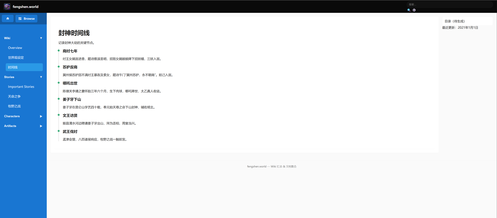
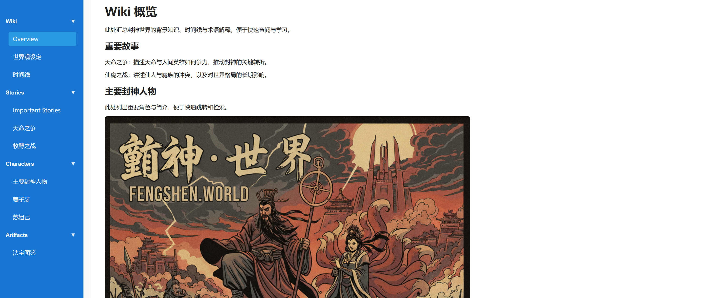

# fengshen

封神·世界（fengshen.world）

这是一个使用 Vue 3 和 Vite 搭建的前端项目仓库，已配置用于 Cloudflare Pages 自动构建与部署。

项目演示（UI 预览）





主要特性

- 使用 Vue 3 + Vite，快速的本地开发体验
- 支持 Cloudflare Pages 自动构建与部署

快速开始

1. 克隆仓库并进入目录：

```bash
git clone <your-repo-url>
cd fengshen
```

2. 安装依赖：

```bash
npm install
```

3. 本地开发：

```bash
npm run dev
# 打开浏览器访问 Vite 提示的地址（通常是 http://localhost:5173）
```

4. 生产构建：

```bash
npm run build
```

Cloudflare Pages 部署（已配置）

- 在 Pages 项目设置中设置：
	- 构建命令（Build command）： `npm run build`
	- 输出目录（Publish directory）： `dist`
	- 确保仓库包含 `package.json` 和 lockfile（推荐）
- 如果使用 Vue Router 的 history 模式，请开启 Pages 的「SPA 回退 / rewrite to index.html」。
- 如需在构建时使用环境变量，请在 Pages 的环境变量设置中添加相应的键值对。

项目结构（简要）

```
.
├─ index.html           # Vite 入口模版
├─ package.json
├─ vite.config.js
├─ src/
│  ├─ main.js           # Vue 入口
│  ├─ App.vue           # 主组件
│  ├─ styles.css
│  └─ assets/
│     └─ img/
│        └─ project-UI/    # 本 README 中引用的 UI 截图
```

贡献指南

- 欢迎提交 Issues 或 Pull Requests。请在 PR 中清晰描述你的变更目的与影响。
- 提交前请确保本地构建通过：`npm run build`。

许可证

此仓库默认未指定具体开源许可证。若你希望公开共享，请添加如 MIT、Apache-2.0 等许可证文件（`LICENSE`）。

作者

fengshen.world by rzx.me

图片优化建议

- 压缩图片：使用工具（例如 `imagemin`、`sharp` 或在线服务）把 PNG/JPG 减小体积。
- 生成 WebP：WebP 在体积上通常优于 PNG/JPEG，可同时保留一份原始格式作为回退。示例（使用 sharp）：

```js
// node 脚本示例：convert.js
import sharp from 'sharp'
await sharp('src/assets/img/project-UI/fengshen-UI-02.png')
	.resize(1200)
	.webp({ quality: 80 })
	.toFile('src/assets/img/project-UI/fengshen-UI-02.webp')
```

- 自动化（npm script）：在 `package.json` 中添加脚本，或在 CI 中运行图片压缩步骤。

Cloudflare Pages 与 SPA 回退

- 本仓库包含 `public/404.html`（会在构建时复制到 `dist/404.html`），用于在 Pages 上提供简单的 SPA 回退：当用户直接访问子路由时，Pages 会返回该 404 并重定向到根页面，从而使前端路由能接管导航。

